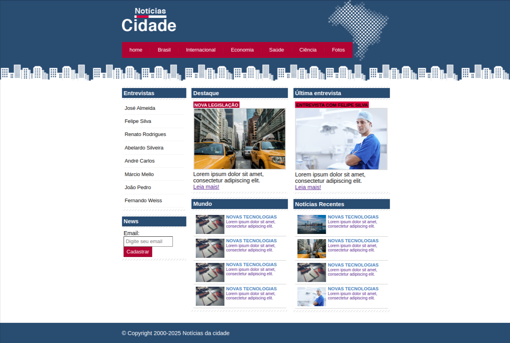

# 📰 Notícias da Cidade



Este é um projeto fictício de um blog de notícias locais chamado **Notícias da Cidade**, desenvolvido utilizando **HTML** e **CSS puro**. O objetivo principal foi revisar os fundamentos do **frontend** e praticar a estruturação de páginas estáticas com estilos personalizados.

## 🎯 Objetivos do Projeto

- Revisar e reforçar os conhecimentos em HTML e CSS.
- Criar um site estático simples com foco em estrutura, sem JavaScript.
- Aprender a organizar arquivos de um projeto frontend.
- Utilizar o GitHub para versionar e hospedar o código.

## 🛠️ Tecnologias Utilizadas

- **HTML5**
- **CSS3**
- **Visual Studio Code** (VS Code)
- **GitHub** (para versionamento e armazenamento dos códigos)

## 📁 Estrutura do Projeto

├── index.html # Página principal com layout do blog
├── style.css # Estilos aplicados à página
└── imagens/ # Pasta com imagens utilizadas no projeto


## ▶️ Como Rodar o Projeto

Siga os passos abaixo para visualizar o site localmente no seu computador:

1. **Clone ou baixe este repositório:**

   Se estiver usando o Git:
   ```bash
   git clone https://github.com/seu-usuario/SiteDeNoticiasDaCidade.git

2. **Abra o projeto em algum editor de texto de preferência:**

3. **Abre o index.html do projeto em um browser:**
